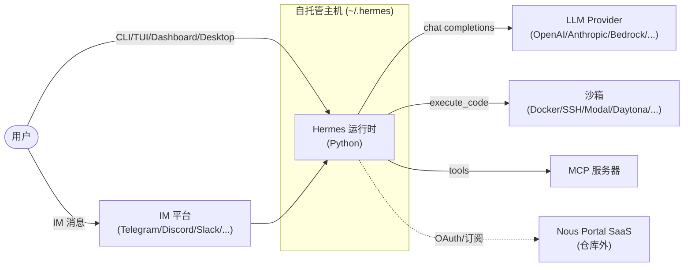
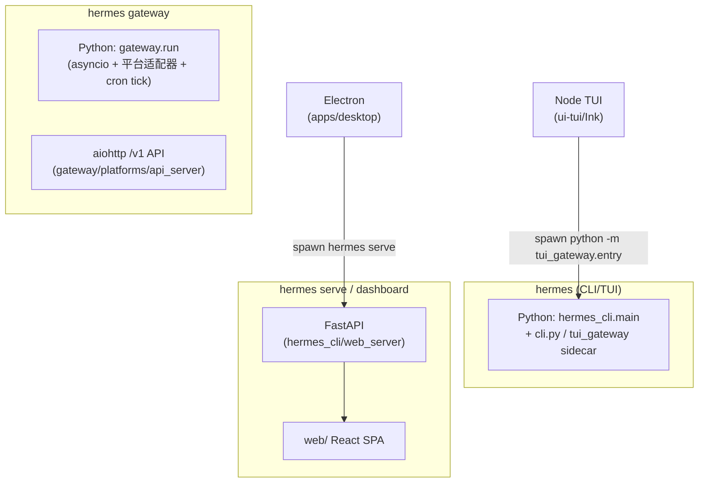
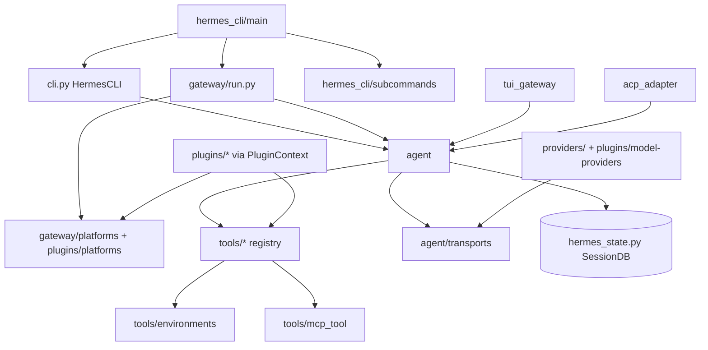
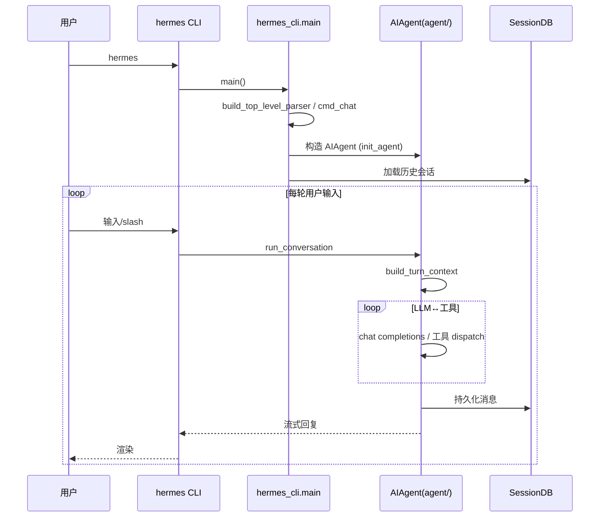
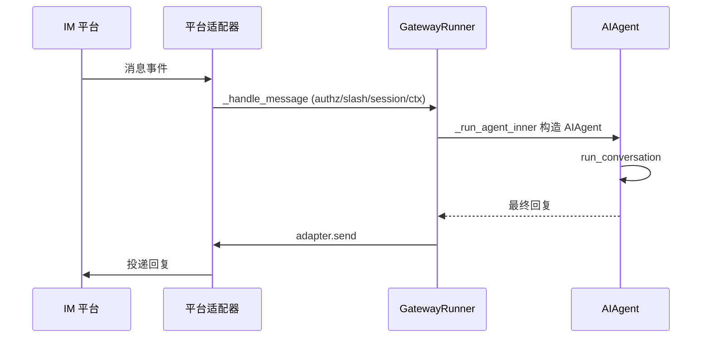

# SOURCE_ARCHITECTURE.md — 源码架构（最完整文档）

## 分析快照

- 分支：main
- HEAD：a9cc17fd80648bfee0d0b677fa9ea91421f329fc
- 工作区状态：clean
- 子模块状态：无
- 分析时间：2026-07-18
- 分析范围：全仓库顶层结构与关键调用链（`agent/`、`run_agent.py`、`cli.py`、`hermes_cli/`、`gateway/`、`tools/`、`providers/`、`plugins/`、`cron/`、`tui_gateway/`、`acp_adapter/`、`apps/`、`web/`、`ui-tui/`）
- 未覆盖范围：`tests/`（见 `测试与CI.md`）、`website/` 内容细节、各适配器内部逐函数实现

## 证据分类

- Evidence：目录/文件、类、import、注册调用
- Inference：模块职责与分层（由调用关系推导）
- Unknown：部分巨型文件内部未穷尽读取

## 核心结论

[Evidence] 仓库是一个**多语言 monorepo**，根目录即 Python 包源码根。Python 运行时由"巨型模块 + 已拆分的 `agent/` 子包"混合构成，处于持续重构中。前端/桌面/文档站为独立 npm workspace。无 Git 子模块、无 vendored 源码。

---

## 1. 仓库总体结构

```text
mozi-hermes-agent/                       # Python 包根 = 仓库根
├── (顶层 .py 模块)                      # py-modules：run_agent, cli, model_tools, toolsets,
│                                        #   batch_runner, trajectory_compressor, toolset_distributions,
│                                        #   cli(旧), hermes_bootstrap, hermes_constants, hermes_state,
│                                        #   hermes_time, hermes_logging, utils, mcp_serve
├── agent/          (153)                # ★ 运行时核心（从 run_agent.py 拆出）
├── hermes_cli/     (205)                # ★ CLI 调度、子命令、配置、dashboard、插件管理
├── tools/          (115)                # ★ 工具实现 + registry
├── gateway/        (76)                 # ★ 消息网关运行时 + 内置平台适配器
├── providers/      (3)                  # 模型 provider 注册（+ plugins/model-providers/）
├── plugins/        (313)                # ★ 插件宿主：platforms/memory/model-providers/browser/...
├── skills/         (453)                # 活动技能集（SKILL.md）
├── optional-skills/(512)                # 按需安装的官方技能（Skills Hub）
├── optional-mcps/  (4)                  # 按需安装的 MCP 目录（blender/linear/n8n/unreal）
├── cron/           (11)                 # ★ cron 调度器
├── acp_adapter/    (11)                 # ACP 服务端（供编辑器驱动）
├── acp_registry/   (2)                  # ACP 分发元数据
├── tui_gateway/    (14)                 # TUI 的 Python sidecar
├── apps/           (1006)               # desktop(Electron) / bootstrap-installer(Tauri) / shared(TS)
├── web/            (145)                # Dashboard SPA（React/Vite）
├── ui-tui/         (382)                # TUI（Ink/React）
├── website/        (739)                # Docusaurus 文档站
├── tools/ (已列) / scripts(46) / docker(16) / nix(12) / packaging(2) / locales(16) / docs(12)
├── tests/ + tests-js/                   # 测试
├── pyproject.toml / uv.lock / setup.py / package.json / package-lock.json
├── Dockerfile / docker-compose*.yml / flake.nix
└── README* / CONTRIBUTING* / SECURITY* / AGENTS.md / LICENSE
```

[Inference] 顶层"巨型 `.py`"是历史核心；`agent/` 是其拆分目标。`run_agent.py:AIAgent` 的方法多为转发到 `agent/` 子模块（forwarder 见 `run_agent.py:4685,4981,5204,5545,5915,6079`）。

---

## 2. 分层与依赖方向

[Inference] 自下而上的逻辑分层（**非**目录名直接映射，由调用关系推导）：

```text
表示层 (Presentation)
  cli.py (HermesCLI) · ui-tui/ · web/ · apps/desktop/ · gateway 平台适配器 · acp_adapter · mcp_serve
        │  (各自驱动 agent 运行时)
        ▼
调度/编排层 (Orchestration)
  hermes_cli/main.py + subcommands/ · gateway/run.py (GatewayRunner) · cron/scheduler.py · tui_gateway/server.py
        │
        ▼
Agent 运行时核心 (Runtime)
  run_agent.py:AIAgent (状态+转发) → agent/* (conversation_loop, tool_executor, chat_completion_helpers,
        │                            transports, context_engine, memory_manager, curator, ...)
        │
        ▼
能力层 (Capabilities)
  tools/* (registry + 各工具) · toolsets.py · skills/ · tools/mcp_tool.py · tools/environments/
        │
        ▼
资源/持久层 (Resources)
  hermes_state.py(SessionDB SQLite+FTS5) · cron/jobs.json · tools/async_delegation SQLite · plugins/memory/*
        │
        ▼
外部依赖 (External)
  LLM providers · IM 平台 SDK · 沙箱(Docker/Modal/Daytona/SSH/Singularity) · MCP servers · 浏览器/桌面控制
```

[Evidence] 依赖方向基本单向向下：`agent/` 不 import `hermes_cli/` 或 `gateway/`；`tools/` 不 import `agent/`（agent 调 tools，反之不可）。`gateway/` 依赖 `agent/` 与 `run_agent.py`。

---

## 3. 应用入口

[Evidence]
- `hermes` → `hermes_cli.main:main`（`pyproject.toml:308`；`hermes` launcher）。
- `hermes-agent` → `run_agent:main`（`pyproject.toml:309`；一次性/datagen）。
- `hermes-acp` → `acp_adapter.entry:main`（`pyproject.toml:310`）。
- Electron 入口 `apps/desktop/electron/main.ts` 拉起 `hermes serve`（`apps/desktop/electron/backend-command.ts:18-21`）。
- TUI 入口 `ui-tui/src/entry.tsx`，spawn `python -m tui_gateway.entry`（`ui-tui/src/gatewayClient.ts:356`）。

---

## 4. 模块边界与职责（关键模块）

### 4.1 `agent/` — 运行时核心
| 子模块 | 职责 | 关键符号 | Evidence |
| --- | --- | --- | --- |
| `conversation_loop.py` | **主 agent 循环** | `run_conversation:537`，while 循环 `:661` | 同 |
| `turn_context.py` | 每轮 prologue（系统提示、压缩、plugin hook） | `build_turn_context` | 同 |
| `chat_completion_helpers.py` | LLM 调用、fallback、build_kwargs | `interruptible_api_call:389`、`build_api_kwargs:854`、`try_activate_fallback:1407` | 同 |
| `tool_executor.py` | 工具调度（并发/顺序/分段） | `execute_tool_calls_concurrent:327`、`_sequential:1028`、`_segmented:1742` | 同 |
| `transports/` | 数据格式层（per api_mode） | `ProviderTransport`（`base.py:16`）；chat_completions/anthropic/bedrock/codex/codex_app_server | 同 |
| `context_engine.py` / `context_compressor.py` / `conversation_compression.py` | 上下文窗口管理 | — | 同 |
| `system_prompt.py` / `prompt_builder.py` / `prompt_caching.py` | 提示组装与缓存 | `_load_skills_snapshot`（`prompt_builder.py:1290`） | 同 |
| `memory_manager.py` | 记忆 provider 工具路由 | `handle_tool_call` | `tool_executor.py:1455` |
| `curator.py` / `background_review.py` / `learning_graph.py` / `insights.py` | 自我改进/学习/洞察 | curator 默认关闭 `:74` | 同 |
| `moa_loop.py` / `moa_trace.py` | Mixture-of-Agents | — | 同 |
| `auxiliary_client.py`（7881 行） | 辅助 LLM 调用（压缩/视觉/摘要/标题） | — | 同 |
| `error_classifier.py` / `errors.py` / `retry_utils.py` | 错误模型与重试 | — | 同 |
| `agent_init.py` | `init_agent`（`AIAgent.__init__` 的真实实现） | `init_agent` | `run_agent.py:493` |
| `secret_sources/` / `credential_pool.py` / `credential_sources.py` | 凭据管理 | — | 同 |

### 4.2 `hermes_cli/` — CLI 与配置
- `main.py`（15147 行）：顶层 argparse 调度（`main:13166`）。
- `_parser.py`：`build_top_level_parser`。
- `subcommands/*.py`：每个 `hermes <sub>` 的 `build_*_parser`。
- `config.py`（8835 行）：`load_config`/`load_cli_config`，原子 YAML 写（RLock 缓存）。
- `cli_agent_setup_mixin.py:_init_agent:226`：`HermesCLI` 构造 `AIAgent` 之处。
- `middleware.py`：`run_llm_execution_middleware`、`run_tool_execution_middleware`（包裹每次 LLM/工具调用）。
- `plugins.py`（2466 行）：**插件管理器**（见 `扩展机制.md`）。
- `web_server.py`：**Dashboard FastAPI 服务**（`app:264`）。
- `dashboard_auth/`、`dashboard_register.py`：dashboard 本地鉴权。

### 4.3 `tools/` — 工具系统
- `registry.py`：`ToolRegistry`（`:217`）+ 模块单例 `registry`（`:765`）；`dispatch:614`；`discover_builtin_tools:67`。
- 每个工具文件在 import 时 `registry.register(...)`（例 `tools/file_tools.py:2104-2107`）。
- `delegate_tool.py` / `async_delegation.py`：子 agent 委派。
- `environments/`：6 沙箱后端（local/docker/ssh/singularity/modal/daytona + managed_modal）。
- `computer_use/`、`browser_*`、`mcp_tool.py`、`cronjob_tools.py`、`skills_tool.py`、`skill_manager_tool.py`。

### 4.4 `gateway/` — 消息网关
- `run.py`：`GatewayRunner`（`:2947`），inbound 管道（`_handle_message:9235`），`main:21755`。
- `platforms/base.py`：`BasePlatformAdapter(ABC):2296`。
- `platform_registry.py`：`PlatformRegistry:162` + 延迟加载器。
- `platforms/`：内置适配器（signal/whatsapp_cloud/weixin/yuanbao/bluebubbles/qqbot/webhook/api_server/msgraph）。
- `delivery.py`：`DeliveryRouter.deliver:246`。
- `config.py`：`Platform` 枚举（`:213`）+ 动态插件平台发现。

### 4.5 `cron/`
- `scheduler.py`：`tick:3801`、`run_job:2591`。
- `jobs.py`：`jobs.json` 存储 + 跨进程锁。

### 4.6 `acp_adapter/`
- `server.py:AcpAgent:451`（`prompt:1296` 用 `run_in_executor:1562` 驱动同步 `AIAgent`）。

### 4.7 `tui_gateway/`
- `entry.py:main:293`；`server.py`（in-process agent + `_SlashWorker:275`）；`ws.py`（`/api/ws:19`）。

---

## 5. 配置 / 错误 / 日志 / 安全边界

- **配置系统**：`config.yaml`（`hermes_cli/config.py`）+ 环境变量 `HERMES_*`（`hermes_cli/env_loader.py`）+ profile 层（`hermes_cli/profiles.py`）。
- **错误模型**：工具错误转 JSON（`registry.dispatch`）；LLM fallback 链；gateway 异常隔离；`agent/error_classifier.py` 分类。
- **日志**：`hermes_logging.py:setup_logging:259`（队列 handler、跨进程文件锁）。
- **安全边界**：
  - 命令审批 `tools/approval.py`（173KB）+ `hermes_cli/write_approval_commands.py`。
  - DM pairing（`gateway/pairing.py`、`gateway/authz_mixin.py`）。
  - 工具 override 策略（`tools/registry.py:316-365`、`PluginToolOverrideError`）。
  - Cron prompt 注入扫描（`tools/cronjob_tools.py:_scan_cron_prompt:229`）+ cron agent 工具集裁剪。
  - MCP 可疑服务过滤（`tools/mcp_tool.py:_filter_suspicious_mcp_servers`）+ 目录供应链 pin 规则（`hermes_cli/mcp_catalog.py`）。

---

## 6. 进程 / 线程 / 异步模型

[Evidence]
- **同步核心**：`AIAgent` 为同步；工具并行用 `ThreadPoolExecutor`（`agent/tool_executor.py:327`）；async handler 经 `model_tools._run_async` 桥接。
- **中断模型**：worker 线程跑阻塞 SDK 调用，主线程可取消（`agent/chat_completion_helpers.py:389`）；`AIAgent.interrupt`/`steer`（`run_agent.py:2731/2842`）。
- **gateway**：`asyncio.run(start_gateway)`，各平台适配器在事件循环内。
- **ACP**：同步 `AIAgent` 在 `ThreadPoolExecutor` 内跑（`acp_adapter/server.py:1562`）。
- **子进程**：codex_app_server（JSON-RPC over stdio）、TUI slash worker（`tui_gateway/server.py:314`）、沙箱（docker/ssh/modal/daytona）。

---

## 7. Mermaid 架构图

### 7.1 系统上下文图



### 7.2 进程/容器图



### 7.3 主要模块依赖图



### 7.4 启动时序图（CLI 对话）



### 7.5 关键调用链（gateway inbound）



---

## 8. 架构边界审计

| 检查项 | 发现 | Evidence |
| --- | --- | --- |
| 循环依赖 | 未发现明显模块级循环；`agent/`↔`tools/` 为单向（agent→tools） | import 关系 |
| 跨层调用 | `cli.py` 既负责 UI 又混入业务（`HermesCLI` 同时 mix `CLIAgentSetupMixin`+`CLICommandsMixin`） | `cli.py:3657` |
| 全局可变状态 | 多处模块级单例/状态：`tools/registry.py:765`、`tools/delegate_tool.py:143-144`、`tools/async_delegation.py`（daemon executor + SQLite）、`cli.py:730 CLI_CONFIG`（import 时求值）、`run_agent.py:269` prewarm Event、`agent/skill_commands.py:23-24` 缓存 | 同 |
| 隐式依赖 | `cli.py:730` import 时加载配置（须在 import 前设环境变量）；MCP 注册须在事件循环就绪后（`model_tools.py:196-210`） | 同 |
| 模块职责重叠 | `run_agent.py` 与 `agent/` 职责重叠（forwarder 重构未完成）；`cli.py` 与 `hermes_cli/cli_commands_mixin.py` 职责交织 | `run_agent.py:4685+` |
| 数据访问泄漏 | 工具直接访问文件系统/子进程；审批机制是软边界 | `tools/file_tools.py`、`tools/approval.py` |
| UI↔业务耦合 | `cli.py` `HermesCLI` 耦合 agent 构造与渲染 | `cli.py:3657` |
| 平台代码泄漏 | Windows/POSIX 分支散布（`hermes_bootstrap.py`、`hermes_cli/gateway_windows.py`、`hermes_cli/win_pty_bridge.py`、`psutil_android.py`） | 同 |
| 错误边界 | 工具错误转 JSON 不抛出（好）；gateway 异常隔离（好）；但部分 `except Exception: pass`（如 `conversation_loop.py:579`） | 同 |
| 生命周期边界 | gateway/cron/async_delegation 有显式资源清理；codex_app_server 子进程有 shutdown | `gateway/shutdown_forensics.py`、`tools/mcp_tool.py:5704` |

---

## 已确认事实

- 单向分层（表示→编排→运行时→能力→资源→外部）。
- `agent/` 为运行时核心，`run_agent.py` 为其半拆分外壳。
- 四套独立扩展机制（plugins/skills/tools/MCP）+ provider/cron/acp 各自注册路径。

## 合理推断

- "巨型文件 + 子包"并存是有意渐进重构的中间态。
- 全局单例（registry、plugin manager、daemon executor）使多实例运行存在风险。

## Unknown 与待验证事项

- 部分巨型文件（`agent/auxiliary_client.py` 7881 行、`gateway/platforms/yuanbao.py`、`gateway/run.py` 21000+ 行）未穷尽逐函数分析。

## 批判性评估

- `cli.py`（16465 行）与 `gateway/run.py`（21000+ 行）体积过大，UI/业务/平台协议混杂，维护风险高。
- 全局可变状态 + import 时副作用降低可测试性与多实例安全。

## 建设性改善建议

- [Recommendation] 完成 `run_agent.py`→`agent/` 拆分，消除 forwarder 双重维护。优先级：中；难度：高。
- [Recommendation] 将 `gateway/run.py` 按职责（adapter 编排 / inbound 管道 / agent 执行 / 投递）拆分为子模块。优先级：中；难度：高。
- [Recommendation] 将 `cli.py:730` 等 import 时副作用改为显式初始化，降低环境变量时序耦合。优先级：中；难度：中。

## 主要证据索引

- `pyproject.toml:307-357`
- `run_agent.py:395,418,493,4685,4981,5204,5545,5915,6079`
- `agent/conversation_loop.py:537,661`
- `agent/chat_completion_helpers.py:317,389,854,1407`
- `agent/tool_executor.py:327,1028,1742`
- `agent/transports/base.py:16`
- `tools/registry.py:67,217,365,614,765`
- `gateway/run.py:9235,11187,17586,17736,21755,2947`
- `gateway/platforms/base.py:2296,2954,4676`
- `hermes_cli/main.py:13166,2255,2006`
- `hermes_cli/plugins.py:135,280,339,1318,1748,1892`
- `cron/scheduler.py:2591,3801`
