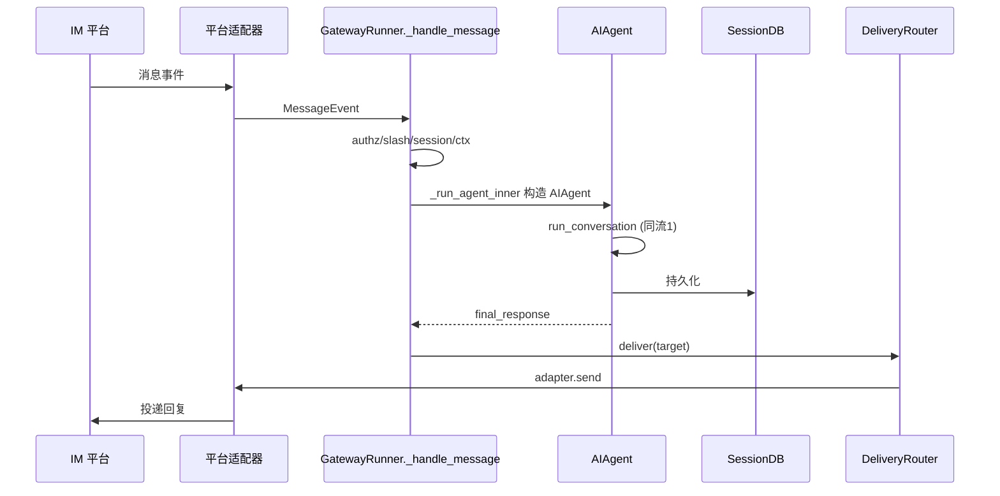
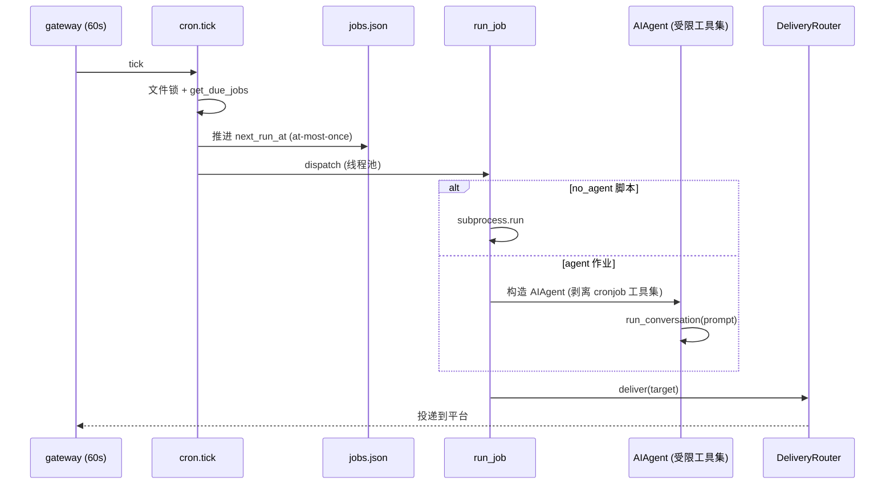
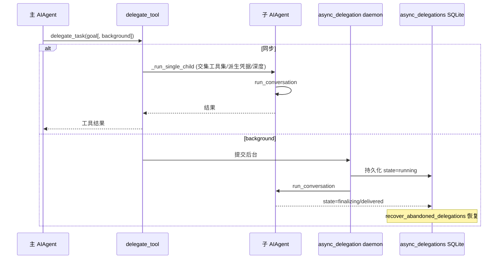

# 核心数据流.md — 关键业务数据流追踪

## 分析快照

- 分支：main
- HEAD：a9cc17fd80648bfee0d0b677fa9ea91421f329fc
- 工作区状态：clean
- 子模块状态：无
- 分析时间：2026-07-18
- 分析范围：`agent/conversation_loop.py`、`agent/tool_executor.py`、`agent/chat_completion_helpers.py`、`gateway/run.py`、`cron/scheduler.py`、`tools/async_delegation.py`、`tools/delegate_tool.py`、`tools/skills_tool.py`、`tools/mcp_tool.py`、`hermes_state.py`
- 未覆盖范围：各 provider/平台协议级细节

## 证据分类

- Evidence：函数调用链与持久化点
- Inference：跨模块数据流向
- Unknown：真实网络往返时序（需动态观测）

## 核心结论

[Evidence] 所有核心数据流最终汇聚到 **`AIAgent.run_conversation`**（`agent/conversation_loop.py:537`）的 while 循环（`:661`）：LLM 调用 ↔ 工具执行 ↔ 消息追加，直到无 tool_calls 或预算耗尽，结果持久化到 `SessionDB`。

---

## 数据流 1：CLI/TUI 一次对话回合

- 触发点：用户在 CLI/TUI 输入文本。
- 输入：自然语言文本（+ 可选附件）。
- 前端入口：`cli.py HermesCLI`（或 TUI `gatewayClient.ts` → `tui_gateway/server.py`）。
- 通信边界：CLI 同进程；TUI 经 stdio JSON 帧 / sidecar WS。
- 后端入口：`AIAgent.run_conversation`（`run_agent.py:6079` → `conversation_loop.py:537`）。
- 应用服务/业务：`build_turn_context`（`turn_context.py`）→ 系统提示恢复/构建、压缩、plugin `pre_llm_call`、外部记忆预取。
- 关键函数：`_perform_api_call`（`conversation_loop.py:1355`）→ `interruptible_api_call`（`chat_completion_helpers.py:389`）→ `client.chat.completions.create`（`:317`）。
- 工具执行：`_execute_tool_calls`（`conversation_loop.py:4914`）→ `execute_tool_calls_concurrent`（`tool_executor.py:327`）→ `registry.dispatch`（`registry.py:614`）。
- 持久化：每条消息写入 `SessionDB`（`hermes_state.py`，WAL + 写重试）。
- 错误路径：工具错误转 JSON（不抛出）；LLM 失败走 fallback 链（`try_activate_fallback:1407`）。
- 事务边界：单回合 = 一个 while 循环；无跨回合 DB 事务。
- 并发边界：单 agent 同步；工具内并行受限 ThreadPool。
- 源码证据：`conversation_loop.py:537,661,1355,4914`、`chat_completion_helpers.py:317,389,1407`、`tool_executor.py:327`、`hermes_state.py:971`。

```mermaid
sequenceDiagram
  participant U as 用户
  participant CLI as cli.py / TUI
  participant TC as build_turn_context
  participant Loop as run_conversation
  participant LLM as Provider
  participant TE as tool_executor
  participant Reg as registry.dispatch
  participant DB as SessionDB
  U->>CLI: 输入
  CLI->>Loop: run_conversation(user_message)
  Loop->>TC: build_turn_context
  loop LLM ↔ 工具
    Loop->>LLM: chat.completions.create
    LLM-->>Loop: assistant + tool_calls
    Loop->>DB: 持久化 assistant
    Loop->>TE: execute_tool_calls
    TE->>Reg: dispatch(name,args)
    Reg-->>TE: 结果/error JSON
    TE->>DB: 持久化 tool result
  end
  Loop-->>CLI: final_response (流式)
  CLI-->>U: 渲染
```

---

## 数据流 2：消息网关 inbound（IM → agent → IM）

- 触发点：IM 用户给 bot 发消息。
- 输入：平台事件（文本/语音/图片）。
- 通信边界：平台 SDK（polling/webhook/socket）。
- 后端入口：`BasePlatformAdapter.handle_message`（`gateway/platforms/base.py:4676`）→ `GatewayRunner._handle_message`（`run.py:9235`）。
- 七步管道：authz → slash 命令 → 中断检查 → 会话定位（profile routing）→ 上下文 → 运行 agent → 返回。
- 应用服务：`_handle_message_with_agent`（`run.py:11187`）→ `_run_agent`（`:17586`，profile 作用域）→ `_run_agent_inner`（`:17736`）构造 `AIAgent`。
- 业务处理：`run_conversation`（同流 1）。
- 返回/投递：`DeliveryRouter.deliver`（`gateway/delivery.py:246`）→ `adapter.send`（`base.py:2954`）。
- 持久化：消息/会话入 `SessionDB`；投递状态入 `rich_sent_store`。
- 错误路径：`_gateway_loop_exception_handler`（`run.py:276`）隔离单条消息失败。
- 并发边界：每聊天一个 agent 实例（agent 缓存见 `tests/gateway/`）；gateway 单事件循环。
- 源码证据：`run.py:9235,11187,17586,17736`、`base.py:4676,2954`、`delivery.py:246`。



---

## 数据流 3：Cron 定时任务执行与投递

- 触发点：gateway 每 60s 调 `cron.scheduler.tick`（`scheduler.py:3801`）。
- 输入：`jobs.json` 中到 `next_run_at` 的作业（含 prompt/schedule/deliver/model/skills）。
- 后端入口：`tick` → 取跨进程文件锁 → `get_due_jobs` → **先推进 `next_run_at`**（at-most-once）→ 线程池 dispatch。
- 业务处理：`run_job`（`scheduler.py:2591`）——`no_agent` 脚本作业直接 `subprocess.run`（`:2141`，无 LLM）；否则构造受限工具集的 `AIAgent` 跑 prompt（cron agent 强制剥离 `cronjob` 工具集，`_resolve_cron_disabled_toolsets:156`；prompt 注入扫描 `tools/cronjob_tools.py:_scan_cron_prompt:229`）。
- 持久化：作业状态回写 `jobs.json`；执行记录 `cron/executions.py`；消息入 `SessionDB`。
- 返回/投递：`deliver` 字段经 `DeliveryRouter` 路由到指定平台。
- 事务边界：`next_run_at` 推进 + 执行分离保证不重复执行。
- 并发边界：`HERMES_CRON_MAX_PARALLEL` / 配置线程池（`_get_parallel_pool:501`）。
- 源码证据：`scheduler.py:2591,3801,501`、`jobs.py:71`、`cronjob_tools.py:229`、`delivery.py:246`。



---

## 数据流 4：子 agent 委派（delegate_task）

- 触发点：主 agent 调用 `delegate_task` 工具。
- 输入：目标/goal/上下文/可选 `background=true`。
- 后端入口：`tools/delegate_tool.py`（`_dispatch_delegate_task` 入口 `run_agent.py:5959`；分发点 `tool_executor.py:1390`）。
- 业务处理：`_run_single_child`（`delegate_tool.py:1077`）`from run_agent import AIAgent` 构造子 agent（交集工具集、派生凭据、深度追踪 `_delegate_depth`、role leaf/orchestrator、`max_spawn_depth` 上限默认扁平 `:125,467`）。
- 后台变体：`delegate_task(background=true)` → `async_delegation` daemon `ThreadPoolExecutor`（`:391`）+ SQLite `async_delegations` 持久化（`:93`）+ `recover_abandoned_delegations`（`:219`）。
- 返回：子 agent 结果字符串回传主 agent 作为工具结果。
- 并发边界：进程内子 `AIAgent`（非子进程）；后台委派独立线程。
- 安全：子 agent 审批回调默认 auto-deny（`delegate_tool.py:74 _subagent_auto_deny`），`delegation.subagent_auto_approve=true` 时 auto-approve（`:88`）。
- 源码证据：`delegate_tool.py:74,88,1077,125,467`、`async_delegation.py:93,219,391`、`tool_executor.py:1390`、`run_agent.py:5959`。



---

## 数据流 5：技能查看与自动创建（self-improvement）

- 触发点（查看）：agent 调 `skill_view`；系统提示渐进披露技能（`agent/prompt_builder.py:1290`）。
- 输入：技能名/ID。
- 后端入口：`tools/skills_tool.py:skill_view:961`（注册 `:1718,1753`）。
- 业务处理：`_find_all_skills`（`:669`）扫描 `~/.hermes/skills/` + 外部目录（`agent/skill_utils.py:432,519,797`）→ 解析 SKILL.md frontmatter → 平台/环境过滤 → 读取正文 + 模板渲染 → 使用遥测 bump。
- 触发点（创建）：agent 调 `skill_manage(action="create")` 或 curator 后台评审。
- 后端入口：`tools/skill_manager_tool.py:skill_manage:1323` / `_create_skill:796`。
- 业务处理：原子写 `~/.hermes/skills/<category>/<name>/SKILL.md` → 安全扫描 `_security_scan_skill` → 命中则回滚。
- 自动改进：`agent/curator.py`（默认关闭 `:74`）LLM 合并/伞技能；`agent/background_review.py` 后台评审决定创建/更新。
- 持久化：文件系统（SKILL.md）；学习图 `agent/learning_graph.py`。
- 源码证据：`skills_tool.py:669,961,1718`、`skill_manager_tool.py:796,1323,1546`、`curator.py:74,397-527`、`background_review.py`、`prompt_builder.py:1290`。

---

## 数据流 6：MCP 工具调用（客户端）

- 触发点：agent 调用名为 `mcp__<server>__<tool>` 的工具。
- 输入：工具参数。
- 后端入口：`registry.dispatch` → `tools/mcp_tool.py` handler。
- 业务处理：经存活 MCP 会话调用远端工具 → 结果规范化。
- 注册时机：`register_mcp_servers`（`mcp_tool.py:5162`）在事件循环就绪后并行连接（`_ensure_mcp_loop`，120s 预算）；可疑服务过滤 `_filter_suspicious_mcp_servers`；`shutdown_mcp_servers:5704`。
- 源码证据：`mcp_tool.py:4759,5131,5162,5282,5704`。

---

## 数据流 7：Dashboard 文件上传与 Chat

- 触发点（文件上传）：浏览器 `POST /api/files/upload-stream`。
- 后端入口：`hermes_cli/web_server.py:2059`（多部分流式上传，依赖 `python-multipart`）。
- 触发点（Chat）：浏览器 WS `/api/pty`（`:16186` PTY 桥）+ `/api/ws`（`:16363` JSON-RPC）。
- 业务处理：PTY 桥接 `hermes` CLI；后台动作 `subprocess.run(hermes …)`（`:1572,3126`）。
- 持久化：文件落盘；会话入 `SessionDB`。
- 源码证据：`web_server.py:2059,16186,16363,1572`。

---

## 数据流 8：OpenAI 兼容 API 请求

- 触发点：外部客户端 `POST /v1/chat/completions`。
- 后端入口：`gateway/platforms/api_server.py:_handle_chat_completions:2552`。
- 鉴权：`_check_auth:1234`（Bearer）；幂等 `_IdempotencyCache:798`（300s）。
- 业务处理：经 `ResponseStore`（`:404`）关联会话 → 构造 `AIAgent` → `run_conversation`（同流 1）。
- 返回：OpenAI 格式响应（或 `/v1/runs` SSE）。
- 源码证据：`api_server.py:1234,1497,2552,404,798`。

---

## 数据流质量审查

| 检查项 | 发现 | Evidence |
| --- | --- | --- |
| 数据重复转换 | transports 层做格式转换；MoA 多路结果聚合（`agent/moa_loop.py`）存在多次 LLM 调用 | transports/、moa |
| 错误丢失 | 工具错误转 JSON（不丢失）；但部分 `except Exception: pass`（如 `conversation_loop.py:579` MoA 解码）吞错 | 同 |
| 多真相来源 | 会话真相在 `SessionDB`；但 cron jobs.json、async_delegations、各 registry 运行时状态分散 | 各存储 |
| 越层访问 | gateway `_run_agent_inner` 直接构造 `AIAgent`，跨"网关→运行时"层 | `run.py:17736` |
| 事务边界不明确 | 跨回合无 DB 事务；`next_run_at` 推进与执行分离（cron 有意） | scheduler.py |
| 非幂等操作 | 文件写入/patch/终端命令非幂等（由审批与 checkpoint 缓解） | tools/file_tools、checkpoint |
| 潜在竞态 | SessionDB 并发写（多进程：gateway/TUI/dashboard/MCP 各自写 agent.log 与 state）；daemon executor 全局共享 | hermes_logging 注释、async_delegation |

---

## 已确认事实

- 8 条数据流均可从入口端到端追踪到持久化/输出。
- 全部汇聚于 `run_conversation` 的 LLM↔工具循环 + `SessionDB`。

## 合理推断

- MoA、auxiliary client 引入额外 LLM 往返，是延迟与成本的主要来源之一。

## Unknown 与待验证事项

- 真实网络往返、provider 限流下的实际时序。
- 多进程并发写 `SessionDB` 在高负载下的竞争表现。

## 批判性评估

- 多个真相来源（SessionDB / jobs.json / async_delegations / 各 registry 运行时状态）缺乏统一一致性保证。
- 部分 `except: pass` 吞错，调试困难。

## 建设性改善建议

- [Recommendation] 收敛运行时状态真相源，或为跨存储关键状态增加一致性校验。优先级：中；难度：高。
- [Recommendation] 将 gateway 直接构造 `AIAgent` 的路径收敛到一个"agent 工厂"服务，减少越层。优先级：低；难度：中。
- [Recommendation] 审查并显式记录/上报被吞掉的异常（如 MoA 解码）。优先级：中；难度：低。

## 主要证据索引

- `agent/conversation_loop.py:537,661,1355,4914,579`
- `agent/chat_completion_helpers.py:317,389,1407`
- `agent/tool_executor.py:327,1390`
- `tools/registry.py:614`
- `gateway/run.py:9235,11187,17586,17736,276`
- `gateway/platforms/base.py:4676,2954`、`gateway/delivery.py:246`
- `cron/scheduler.py:2591,3801,501`、`cron/jobs.py:71`、`tools/cronjob_tools.py:229`
- `tools/delegate_tool.py:74,88,1077,125,467`、`tools/async_delegation.py:93,219,391`
- `tools/skills_tool.py:669,961,1718`、`tools/skill_manager_tool.py:796,1323`
- `tools/mcp_tool.py:4759,5162,5282,5704`
- `hermes_cli/web_server.py:1572,2059,16186,16363`
- `gateway/platforms/api_server.py:404,798,1234,2552`
- `hermes_state.py:971`
