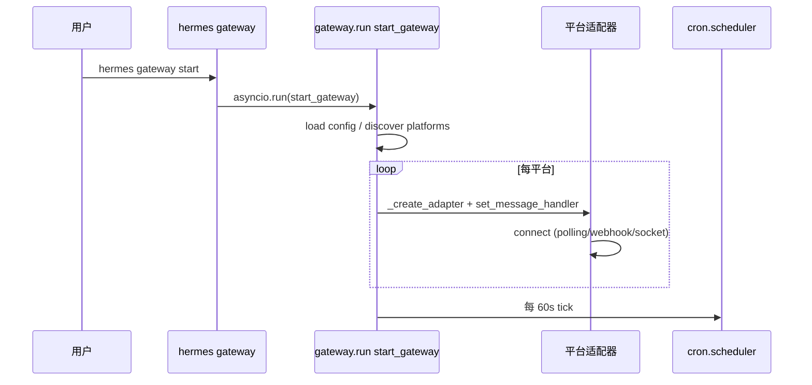
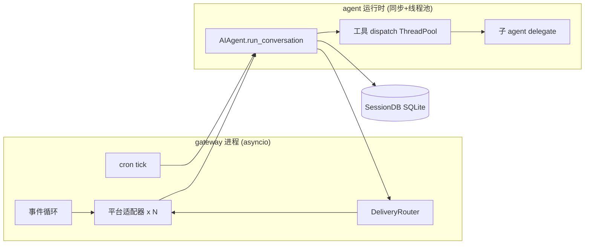
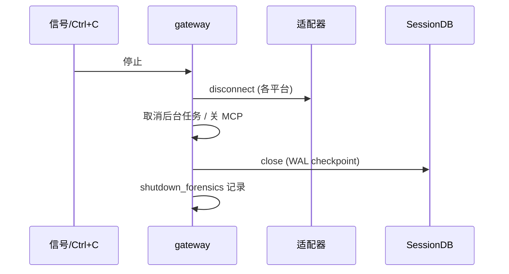
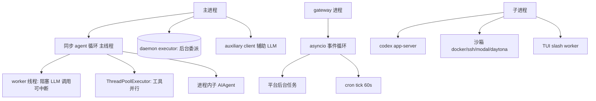

# 运行时架构.md — 运行期实际结构

## 分析快照

- 分支：main
- HEAD：a9cc17fd80648bfee0d0b677fa9ea91421f329fc
- 工作区状态：clean
- 子模块状态：无
- 分析时间：2026-07-18
- 分析范围：`agent/`、`run_agent.py`、`gateway/run.py`、`cron/`、`tui_gateway/`、`acp_adapter/`、`hermes_cli/web_server.py`、`tools/async_delegation.py`、`tools/delegate_tool.py`、`agent/transports/`
- 未覆盖范围：真实进程的运行时性能/内存画像（未动态执行）

## 证据分类

- Evidence：进程/线程/生命周期代码
- Inference：运行期组件关系
- Unknown：真实部署的进程数与资源占用（需动态观测）

## 核心结论

[Evidence] Hermes 运行期是**多进程 + 同步核心 + asyncio（gateway）+ 线程池（工具并行/子 agent）**的混合模型。进程组成取决于入口（CLI / gateway / dashboard / TUI / desktop / ACP），但都围绕同一个同步 `AIAgent` 运行时。

---

## 1. 进程组成

| 进程 | 来源入口 | 角色 | Evidence |
| --- | --- | --- | --- |
| `hermes`（CLI/TUI Python 主） | `hermes_cli.main:main` | 同步 agent 运行时 | `main.py:13166` |
| TUI Node 进程 | `ui-tui/src/entry.tsx` | 终端 UI；spawn Python sidecar | `gatewayClient.ts:356` |
| `tui_gateway` Python sidecar | `python -m tui_gateway.entry` | TUI↔agent 桥；in-process agent + slash worker 子进程 | `tui_gateway/server.py:275,314` |
| gateway Python 进程 | `hermes gateway` / `gateway/run.py:main` | asyncio 事件循环 + 平台适配器 + cron tick | `run.py:21755` |
| Dashboard Python 进程 | `hermes serve/dashboard` | FastAPI + 后台 action 子进程 | `web_server.py:264` |
| Electron 主进程 | `apps/desktop` | 拉起 `hermes serve`，渲染层 | `backend-command.ts:18-21` |
| ACP 进程 | `hermes-acp` | JSON-RPC over stdio；`run_in_executor` 跑同步 agent | `acp_adapter/server.py:1562` |
| MCP server 进程 | `hermes mcp serve` | stdio MCP 服务端 | `mcp_serve.py:959` |
| Codex app-server 子进程 | codex_app_server transport | JSON-RPC over stdio 的外部 `codex app-server` | `agent/transports/codex_app_server.py:130` |
| 沙箱子进程 | `tools/environments/*` | docker/ssh/modal/daytona/singularity 执行 | `tools/environments/` |
| Cron agent（临时） | `cron/scheduler.py:run_job` | 构造 `AIAgent` 跑 prompt 后销毁 | `scheduler.py:2591` |
| 后台委派 worker | `tools/async_delegation.py` daemon ThreadPool | 后台子 agent | `async_delegation.py:391` |
| Dashboard action 子进程 | `web_server.py` `subprocess.run(hermes …)` | 后台动作 | `web_server.py:1572,3126` |

[Inference] 多数部署只运行其中一两个进程组合（如 gateway 单进程含 cron tick；或 desktop = Electron + `hermes serve` + 浏览器）。

---

## 2. 线程 / 异步任务 / 前后端运行边界

[Evidence]
- **同步核心**：`AIAgent.run_conversation`（`agent/conversation_loop.py:537`）同步；LLM 调用经 worker 线程以便主线程中断（`agent/chat_completion_helpers.py:389`）。
- **工具并行**：`ThreadPoolExecutor`（`agent/tool_executor.py:327` 并发路径；`_run_tool:573`）。
- **async 桥接**：`model_tools._run_async`（`model_tools.py:88`）把 async handler 接入同步 dispatch。
- **gateway**：单一 asyncio 事件循环（`asyncio.run(start_gateway)`）；平台适配器作为后台任务（如 Discord `client.start` task、Slack Socket Mode task、Telegram polling）。
- **ACP**：asyncio 事件循环 + `loop.run_in_executor(ThreadPoolExecutor)` 跑同步 agent（`acp_adapter/server.py:1562`）。
- **TUI sidecar**：in-process agent + 独立 slash-worker 子进程（`tui_gateway/server.py:314`）。
- **子 agent**：进程内 `AIAgent` 实例（`tools/delegate_tool.py:_run_single_child:1077`），非子进程；后台委派走 daemon executor。

[Evidence] 前后端边界：前端（Web/TUI/Electron）从不直接调用 agent；全部经 FastAPI（dashboard/desktop）或 Python sidecar（TUI）或 JSON-RPC（ACP）。

---

## 3. 初始化顺序 / 依赖注入 / 服务生命周期

[Evidence] 典型 CLI 启动顺序：
1. `hermes_bootstrap`（Windows stdio）→ `setup_logging` → `load_config`。
2. `build_top_level_parser` → 匹配子命令 → `cmd_chat`。
3. `HermesCLI._init_agent`（`cli_agent_setup_mixin.py:226`）构造 `AIAgent` → `init_agent`（`agent/agent_init.py`）注入 clients/callbacks/budget/locks。
4. 工具发现：`discover_builtin_tools`（import `tools/*.py`）+ `discover_plugins`（`model_tools.py:194,200`）；MCP 注册延后到事件循环就绪（`:196-210`）。
5. 加载历史会话（`SessionDB`）→ 进入交互循环。

[Evidence] gateway 启动：`start_gateway` → 创建适配器（`_create_adapter:7314`）→ 注册 handler（`run.py:7330`：message/fatal_error/session_store/authz）→ 各适配器 `connect` → cron tick 每 60s。

[Inference] 依赖注入为"构造期参数注入"（`AIAgent.__init__` 约 150 个参数，`run_agent.py:418`），无 IoC 容器。

---

## 4. 状态 / 数据库连接 / 后台任务 / 调度 / 事件 / 缓存 / 文件监听 / 插件加载 生命周期

- **状态生命周期**：`AIAgent` 实例持有 per-agent 状态；会话状态持久于 `SessionDB`；per-turn 状态在 `build_turn_context` 建立。
- **DB 连接**：`SessionDB` 打开 SQLite（WAL），写重试带抖动；进程退出时关闭。gateway/cron/dashboard 各自打开所需 SQLite/JSON。
- **后台任务**：async_delegation daemon、cron 调度池、auxiliary client、background review、dashboard action 子进程、平台适配器 polling/webhook。
- **调度**：cron `tick` 每 60s（gateway 驱动）或 `cron/scheduler_provider.py` 进程内 ticker；`next_run_at` 先推进保证 at-most-once（`scheduler.py:3801`）。
- **事件系统**：plugin hooks（`hermes_cli/plugins.py:invoke_hook:1892`）；callback 机制（`AIAgent` 的 `step_callback`/`stream_callback`/`event_callback` 等）。
- **缓存**：工具 `check_fn` TTL、技能扫描 TTL、prompt cache、provider profile 懒加载缓存。
- **文件监听**：`gateway/kanban_watchers.py`；skill 扫描基于 dir-mtime 签名（非 inotify 持续监听）。
- **插件加载**：`discover_plugins`（启动期，`HERMES_SAFE_MODE=1` 跳过）；平台插件延迟加载。

---

## 5. 外部进程 / 资源清理 / 正常关闭 / 异常关闭 / 崩溃恢复 / 平台差异 / 故障模式

- **外部进程**：codex_app_server、沙箱、TUI slash worker、dashboard action 子进程、MCP server（stdio）。
- **资源清理**：
  - `shutdown_mcp_servers`（`tools/mcp_tool.py:5704`）。
  - gateway 生命周期 + `gateway/shutdown_forensics.py`。
  - async_delegation `recover_abandoned_delegations`（`:219`）。
  - TUI `_teardown_session`（`tui_gateway/server.py:689`）。
- **正常关闭**：CLI `Ctrl+C`/`/stop`；gateway 优雅停；dashboard lifespan。
- **异常关闭**：`gateway/restart_loop_guard.py`、`gateway/restart.py`；`gateway/cgroup_cleanup.py`。
- **崩溃恢复**：会话持久化 + 写重试 + schema 修复 + 委派恢复 + checkpoint（`agent/file_safety.py`、`tools/checkpoint_manager.py`）。
- **平台差异**：Windows（`hermes_bootstrap`、`gateway_windows`、`win_pty_bridge`、`concurrent-log-handler`）、POSIX（`ptyprocess`、fcntl 锁）、Termux（`psutil_android`、curated extra）。
- **故障模式**：provider 401/限流→fallback 链 + 凭据池刷新（`agent/credential_pool.py`、`chat_completion_helpers.py:1407`）；网络错误重试；流超时检测（90s stale / 60s read timeout，`conversation_loop.py` 注释）。

---

## 6. 编译期 / 启动期 / 运行期 / 关闭期 结构区分

| 阶段 | 结构 |
| --- | --- |
| 编译期 | Python 无编译（.pyc 缓存）；前端 Vite/esbuild/electron-builder/Tauri 构建产物入 `web_dist`/`tui_dist` |
| 启动期 | bootstrap → logging → config → 工具/插件发现 → 构造 `AIAgent` → 注册 handler/路由 |
| 运行期 | 同步 agent 循环 + asyncio(gateway) + 线程池(工具/子 agent) + 后台任务/cron |
| 关闭期 | 信号 → 优雅停各适配器/后台任务 → 关 DB → 子进程清理 → forensics 记录 |

---

## 7. Mermaid 运行时图

### 7.1 启动时序（gateway）

### 7.2 正常运行组件图

### 7.3 关闭时序

### 7.4 进程/线程/异步任务关系

---

## 已确认事实

- 同步 agent 核心 + asyncio(gateway) + 线程池(工具/子 agent) 混合模型。
- 多入口对应不同进程组合；前端永不直连 agent。
- 有显式资源清理、崩溃恢复、平台差异处理。

## 合理推断

- 多数部署仅运行 1–2 个进程；gateway 单进程承担平台 + cron + agent。

## Unknown 与待验证事项

- 真实部署进程数/内存/CPU 画像（需动态观测）。
- 高并发下 SessionDB 写竞争实际表现。

## 批判性评估

- 同步核心 + asyncio + 线程池混合模型复杂，中断/取消路径多，易出竞态。
- 全局 daemon executor（async_delegation）+ 全局 registry 使多实例/测试隔离困难。

## 建设性改善建议

- [Recommendation] 为 `AIAgent` 的可中断 LLM 调用补充显式取消语义文档与测试，降低竞态面。优先级：中；难度：中。
- [Recommendation] 将全局 daemon executor / registry 单例改为可注入的运行时上下文，便于多实例与测试隔离。优先级：中；难度：高。

## 主要证据索引

- `agent/conversation_loop.py:537,661`
- `agent/chat_completion_helpers.py:389`
- `agent/tool_executor.py:327,573`
- `run_agent.py:418,3972,2731,2842`
- `gateway/run.py:7314,7330,21755`
- `cron/scheduler.py:2591,3801`
- `tools/async_delegation.py:219,391`
- `tools/delegate_tool.py:1077`
- `tui_gateway/server.py:275,314,689`
- `acp_adapter/server.py:1562`
- `agent/transports/codex_app_server.py:130`
- `tools/mcp_tool.py:5704`、`gateway/shutdown_forensics.py`、`gateway/restart_loop_guard.py`
